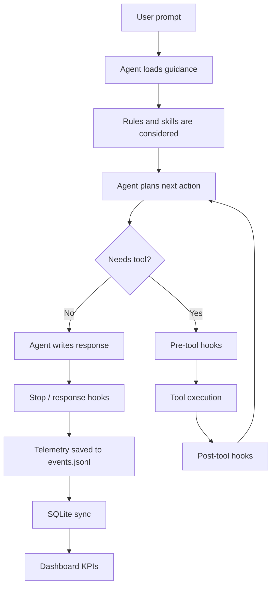
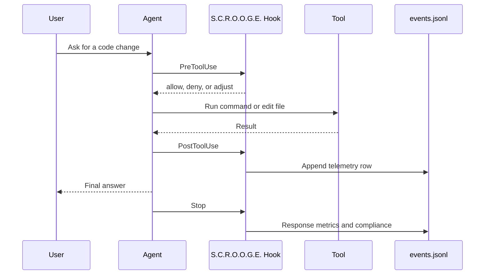
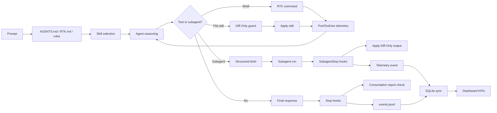

# AI Agent Lifecycle in S.C.R.O.O.G.E.

This document explains what happens during an AI-agent turn when S.C.R.O.O.G.E. is installed around an agent hub such as Codex, Cursor, Claude Code, Gemini, or Antigravity.

The short version: an agent is not only "a model answering a prompt". In this project, an agent turn is a pipeline made of instructions, skills, tool calls, hooks, compression, telemetry, and a dashboard that helps you understand cost and quality.

## Mental Model

An AI coding agent has three layers:

1. **Reasoning layer**: the model decides what to do next.
2. **Execution layer**: tools run commands, edit files, call MCP servers, or delegate to subagents.
3. **Governance layer**: hooks, rules, skills, compression, and telemetry shape the work and measure its cost.

S.C.R.O.O.G.E. mainly lives in the governance layer. It does not replace the agent. It surrounds the agent with guardrails, token-saving behaviors, and observability.

## High-Level Lifecycle



## Stage 1: Startup and Persistent Context

When the agent starts, it loads persistent local guidance.

For Codex, this includes:

- `~/.codex/AGENTS.md`
- `~/.codex/RTK.md`
- `~/.codex/hooks.json`
- `~/.codex/config.toml`
- user skills under `~/.agents/skills`

In this project, the Codex-specific installer files live in:

- `hub_files/codex/AGENTS.md`
- `hub_files/codex/hooks.json`

The installed guidance tells Codex to be token-aware and to use RTK-shaped shell commands when possible.

## Stage 2: Rules and Skills

Rules are lightweight policy. Skills are reusable workflows.

S.C.R.O.O.G.E. installs rules under:

```text
<hub>/rules/
```

and skills under:

```text
<hub>/skills/
```

For Codex, reusable user skills are also installed under:

```text
~/.agents/skills/
```

Important skills in this repo:

| Skill | Purpose |
|---|---|
| `token-budget-guardrail` | Decides whether a costly read, retry, or subagent is worth it. |
| `code-review-graph` | Uses repository graph context before broad file scanning. |
| `spec-driven-idempotency` | Helps parent agents pass enough context to subagents so they do not re-scan everything. |
| `subagent-playbook` | Coordinates broad or multi-track work. |
| `safe-output-hygiene` | Redacts sensitive content and avoids unsafe output. |
| `prompt-to-task-brief` | Turns vague work into a scoped task brief. |

The static prompt registry is built by:

```text
hub_files/src/utils/static_prompt_registry.py
```

It creates a compact index of active rules and skills instead of dumping every full file into context.

## Stage 3: RTK for Shell Commands

RTK means "Rust Token Killer" in this setup. It is a token-efficient CLI proxy.

RTK helps when commands produce large output, such as:

```bash
rtk git status
rtk grep "SomeSymbol"
rtk find "*.py"
rtk npm test
rtk gain
```

Why it matters:

- Raw shell output can consume many tokens.
- RTK compresses or summarizes command output before it reaches the agent.
- `rtk gain` reports how many tokens were saved.

In Codex, RTK is currently initialized through:

```text
~/.codex/RTK.md
```

and S.C.R.O.O.G.E. finds the binary via:

```text
RTK_BIN=/home/matthieu/.local/bin/rtk
```

in:

```text
~/.codex/compression.env
```

The dashboard calls:

```bash
rtk gain -d --format json
```

to populate the "RTK gain (saved)" KPI.

## Stage 4: Hooks

Hooks are lifecycle scripts. They run around agent actions.

In Codex, hooks are configured in:

```text
~/.codex/hooks.json
```

The Codex template in this project is:

```text
hub_files/codex/hooks.json
```

The main Codex hook events used here are:

| Event | S.C.R.O.O.G.E. hook | Purpose |
|---|---|---|
| `PreToolUse` | `codex-rtk-pretool-bash.sh`, `semantic-compress-pretool.sh`, `diff-only-pretool-write.sh` | Rewrites noisy Bash commands through RTK, compresses Task/subagent prompts when exposed as `Task`, and blocks risky full-file writes when Diff-Only policy applies. |
| `UserPromptSubmit` | `tt-user-prompt-submit.sh` | Records prompt-size telemetry before the turn begins. |
| `PostToolUse` | `tt-posttool.sh` | Records tool telemetry. |
| `SubagentStart` | `tt-subagent-start.sh` | Records Codex subagent start telemetry. |
| `SubagentStop` | `diff-only-subagent-stop.sh` and `tt-subagent-stop.sh` | Applies subagent Diff-Only output and records subagent telemetry. |
| `PreCompact` / `PostCompact` | `tt-precompact.sh`, `tt-postcompact.sh` | Records manual or automatic compaction lifecycle telemetry. |
| `Stop` | `tt-after-response.sh` and `stop-compliance.sh` | Records response telemetry and checks consumption-report compliance. |
| `SessionStart` | `crg-session-start.sh` | Refreshes code-review graph context. |

Other hubs such as Cursor or Antigravity use lower-case hook names, configured in:

```text
hub_files/hooks.json
```

## Stage 5: Compression and Context Routing

S.C.R.O.O.G.E. tries to avoid sending unnecessary text to the model.

The compression flow includes:

- **SmartCrusher**: removes low-value repeated text.
- **CCR cache**: stores large reusable text blocks by hash.
- **Claw Compactor**: optional context compaction backend.
- **Headroom adapter**: another optional compression backend.
- **Adaptive context routing**: builds structured prompt blocks instead of raw history.

Relevant files:

```text
smart_crusher.py
ccr_manager.py
claw_compactor_adapter.py
headroom_adapter.py
hub_files/hooks/semantic-compress-pretool.py
hub_files/src/utils/adaptive_context_manager.py
```

The adaptive context manager thinks in blocks:

| Block | Meaning |
|---|---|
| `BLOCK_1` | Static rules, skills, and global guidance. |
| `BLOCK_1B` | Token-budget guardrail report. |
| `BLOCK_2` | Git and workspace state. |
| `BLOCK_3` | Compacted dynamic history. |
| `BLOCK_4` | Latest user query. |

This is meant to reduce repeated context and avoid the common problem where long chats grow in cost each turn.

## Stage 6: Tool Execution

During a turn, the agent may use tools:

- shell commands
- file reads
- file edits
- MCP tools
- subagents
- browser or UI tools, when available

S.C.R.O.O.G.E. watches those actions through hooks.

For example:



## Stage 7: Diff-Only Output

Large file rewrites are expensive and risky.

The Diff-Only protocol asks the agent or subagent to return small search/replace hunks instead of dumping full files.

Relevant files:

```text
hub_files/rules/diff-only-protocol.mdc
hub_files/src/rules/diff_protocol.md
hub_files/hooks/diff-only-apply.py
hub_files/hooks/diff-only-pretool-write.py
hub_files/src/utils/diff_applier.py
```

This saves output tokens and makes edits easier to audit.

## Stage 8: Subagents

Subagents are useful when work can be split into independent tracks, but they can be expensive if they re-read the same files.

S.C.R.O.O.G.E. tries to make subagents cheaper by requiring structured briefs:

- `Skill: ...`
- `[CONTEXT]` excerpts
- `[GOALS]`
- `[SCOPE]`
- `[CONSTRAINTS]`
- `[AC]` acceptance criteria
- MCP allowlist or denial logic

Important files:

```text
hub_files/rules/subagent-usage.mdc
hub_files/rules/subagent-skill-routing.mdc
hub_files/skills/spec-driven-idempotency/SKILL.md
hub_files/src/utils/task_brief_validator.py
```

The idea is simple: the parent agent should do focused discovery once, then pass compact context to the subagent. The subagent should not start over from scratch.

## Stage 9: Telemetry

Telemetry is the observability layer.

Events are appended to:

```text
<hub>/token-telemetry/events.jsonl
```

For Codex:

```text
~/.codex/token-telemetry/events.jsonl
```

The main telemetry hook script is:

```text
hub_files/hooks/token-telemetry.py
```

It records approximate token proxies, tool activity, edit sizes, subagent coverage, and consumption-report compliance.

The SQLite sync is handled by:

```text
telemetry_db.py
```

The dashboard reads both the JSONL events and the synced SQLite data.

## Stage 10: Dashboard

The dashboard is served by:

```text
serve_dashboard.py
```

Installed Codex runtime files live under:

```text
~/.codex/token-telemetry/
```

The dashboard files are:

```text
dashboard.html
dashboard.css
dashboard.js
icon.jpg
serve_dashboard.py
telemetry_*.py
providers_config.*
rtk_resolver.py
```

The dashboard shows:

- observed token proxies
- RTK saved tokens
- hook compression savings
- Diff-Only savings
- subagent launches/stops
- consumption-report compliance
- recent tool and edit events

You can control the dashboard with:

```bash
~/.codex/bin/dashboard-control.sh status
~/.codex/bin/dashboard-control.sh start
~/.codex/bin/dashboard-control.sh stop
~/.codex/bin/dashboard-control.sh restart
```

## Full S.C.R.O.O.G.E. Flow



## What Saves Tokens?

| Mechanism | Saves tokens by |
|---|---|
| RTK | Compacting shell output. |
| Static prompt registry | Listing rules and skills compactly instead of dumping everything. |
| Adaptive context routing | Reusing structured blocks and compressing history. |
| CCR cache | Replacing large repeated text with references. |
| SmartCrusher / Claw / Headroom | Compressing noisy dynamic context. |
| Diff-Only | Returning small edit hunks instead of full files. |
| Spec-driven idempotency | Preventing subagents from re-reading already-discovered context. |
| Token budget guardrail | Stopping low-ROI reads, retries, and broad exploration. |

## What Improves Quality?

| Mechanism | Improves quality by |
|---|---|
| Skills | Giving the agent repeatable workflows. |
| Rules | Keeping behavior consistent across turns. |
| Structured briefs | Making subagent work scoped and testable. |
| Diff-Only | Making edits smaller and easier to verify. |
| Stop compliance | Forcing a short consumption report and avoiding invisible cost. |
| Dashboard | Showing where cost and behavior drift over time. |

## Important Caveat

Not every agent surface exposes the same lifecycle hooks.

Cursor and Antigravity support some hook names that Codex does not use directly. Codex uses PascalCase hook events such as `PreToolUse`, `PostToolUse`, `UserPromptSubmit`, `SubagentStart`, `SubagentStop`, `PreCompact`, `PostCompact`, and `Stop`.

For Codex, S.C.R.O.O.G.E. uses two reduction paths:

- **Bash path**: `PreToolUse` with matcher `^Bash$` runs `codex-rtk-pretool-bash.sh`. The hook asks `rtk rewrite` for a compact equivalent, returns `updated_input` when RTK has a rewrite, and records `rtkShellRewrite`.
- **Subagent path**: `PreToolUse` with matcher `^Task$` runs `semantic-compress-pretool.sh`. This activates only when Codex exposes the spawn as a `Task` tool. Codex subagents are explicit, so no `Task` launch means no Task compression event.

The practical consequence is important: direct Codex work is mostly optimized through RTK shell rewriting and disciplined tool use, while subagent compression activates only on explicit subagent workflows.

That is why this project has:

```text
hub_files/hooks.json
hub_files/codex/hooks.json
```

They serve the same goal, but the host agent expects a different hook schema.

## Quick Debug Checklist

If a dashboard KPI looks wrong:

1. Check the dashboard process:

   ```bash
   ~/.codex/bin/dashboard-control.sh status
   ```

2. Check RTK:

   ```bash
   /home/matthieu/.local/bin/rtk gain -d --format json
   ```

3. Check telemetry events:

   ```bash
   tail -20 ~/.codex/token-telemetry/events.jsonl
   ```

4. Check hooks:

   ```bash
   sed -n '1,220p' ~/.codex/hooks.json
   ```

5. Check installed dashboard runtime:

   ```bash
   ls ~/.codex/token-telemetry/
   ```

The healthy mental model is: the agent reasons, tools execute, hooks observe and enforce, compression reduces waste, telemetry records what happened, and the dashboard turns that into feedback.
