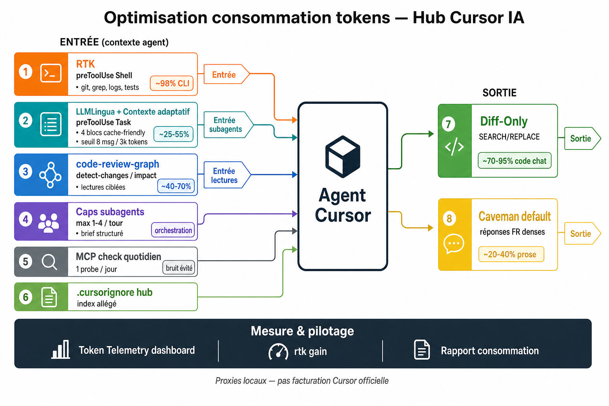
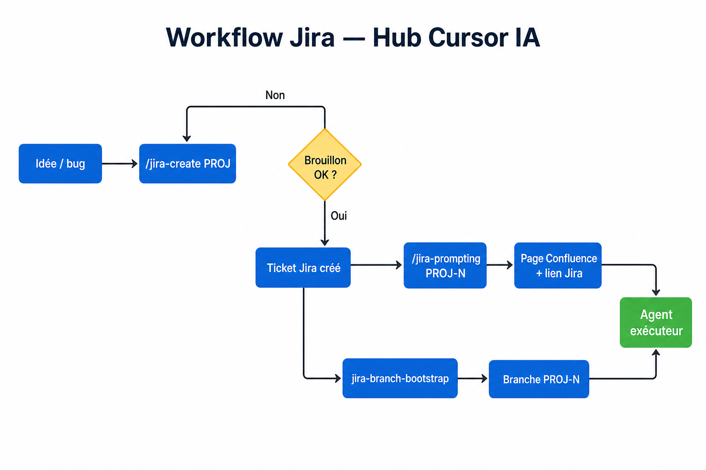
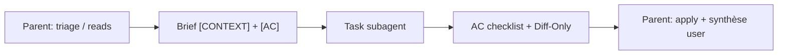

# Antigravity IA — plateforme d’optimisation des agents

**Document unique** · Hub `~/.gemini/antigravity` · Métriques : **29 mai 2026** (actualiser via `rtk gain` + `token-telemetry/report.py` — ligne `claw=` / `llmlingua=`)

Ce hub est le **profil Antigravity global** (macOS, zsh) : règles, skills, hooks et télémétrie s’appliquent à **tous les workspaces** ouverts avec ce compte. Objectif : agents **plus prévisibles**, **moins coûteux en tokens**, et **alignés** sur les workflows métier (Jira, prod, PR, observabilité).

---

## Sommaire

1. [Pourquoi](#pourquoi-cette-plateforme)
2. [Démarrage rapide](#démarrage-rapide-5-minutes)
3. [Scénarios types](#scénarios-types-quoi-demander)
4. [Pipeline & hooks](#vue-densemble-pipeline)
5. [Économies de tokens](#économies-de-tokens--chiffres-à-partager)
6. [Règles Antigravity](#règles-antigravity-rulesmdc)
7. [Skills métier](#skills-métier-skills)
8. [Workflows Jira](#workflows-jira)
9. [Subagents](#subagents--politique-et-routage) — dont [idempotence spec](#spec-driven-idempotency-parent--subagent)
10. [Token budget guardrail](#token-budget-guardrail-arbitrage-amont)
11. [Diff-Only](#diff-only-protocole-code)
12. [RTK](#rtk--cli-token-efficient)
13. [Compression & contexte](#compression--contexte-adaptatif)
14. [Télémétrie](#télémétrie--tableau-de-bord)
15. [MCP](#intégrations-mcp)
16. [Skills éditeur](#skills-antigravity-éditeur)
17. [Bonnes pratiques & FAQ](#bonnes-pratiques-équipe)
18. [Structure & limites](#structure-du-hub)

---

## Pourquoi cette plateforme ?

Sans cadre, un agent tend à : relire tout le repo, lancer plusieurs subagents, recopier des fichiers entiers, et noyer le contexte avec des sorties `git diff` / logs bruts. Le coût (tokens + latence) grimpe vite ; la qualité devient inégale.

| Problème | Solution hub | Gain principal |
|----------|--------------|----------------|
| Fichiers entiers dans le chat | **Diff-Only** + hook d’application | Sortie code |
| CLI verbeux | **RTK** (`preToolUse` Shell) | Entrée contexte |
| Subagents en rafale | **Caps** + brief obligatoire | Entrée + orchestration |
| Exploration aveugle | **code-review-graph** | Entrée (lectures ciblées) |
| Prompts Task énormes | **Claw Compactor** (défaut) + LLMLingua optionnel + contexte adaptatif + **cache Git BLOCK_2** | Entrée subagents |
| Coût invisible | **Télémétrie** + **rapport de consommation** | Pilotage |
| Jira / prod ad hoc | **25 skills** + règles draft-first | Qualité livrable |
| Parent + subagent relisent les mêmes fichiers | **`spec-driven-idempotency`** — `[CONTEXT]` figé, `RESCAN: forbidden` | **~1 passe repo / délégation** évitée |
| Index hub pollué | **`.geminiignore`** | Moins de bruit @codebase |
| Dépense avant réflexion | **Token budget guardrail** (ROI + two-strike) | Entrée + orchestration |

**Principe directeur :** *arbitrer le budget avant la dépense, router avant d’explorer, compresser avant d’envoyer, patcher au lieu de recopier, mesurer au lieu de deviner.*

---

## Démarrage rapide (5 minutes)

| Étape | Action |
|-------|--------|
| 1 | Vérifier que Antigravity utilise bien `~/.gemini/antigravity/hooks.json` (Settings → Hooks, si exposé) |
| 2 | Installer **RTK** et lancer une session agent avec des commandes Shell → `rtk gain` |
| 3 | Ouvrir le dashboard : `python3 ~/.gemini/antigravity/token-telemetry/serve_dashboard.py` → http://127.0.0.1:8765/ (KPI **claw** / hook sur `subagentLaunch`) |
| 3b | *(optionnel)* Vérifier Claw : `~/.gemini/antigravity/bin/claw-compactor --help` |
| 4 | Dans un **repo métier**, ajouter un `AGENT.md` (conventions, stack) — l’agent le lit en priorité |
| 5 | Pour un ticket : `/jira-prompting PROJ-123` ou triage via skill `jira-ticket-triage` |

**Commandes utiles :**

```bash
rtk gain
python3 ~/.gemini/antigravity/token-telemetry/report.py
code-review-graph status          # dans un repo source
export ANTIGRAVITY_DIFF_ONLY_DISABLE=1 # désactiver temporairement Diff-Only
```

---

## Scénarios types (quoi demander)

| Vous voulez… | Demande / commande | Ce qui s’active |
|--------------|-------------------|-----------------|
| Créer un ticket bien cadré | `/jira-create SHOP Description du bug` | `jira-create` → analyse repo → **brouillon** → création **après votre OK** |
| Ticket → prompt pour un autre agent | `/jira-prompting SHOP-123` | `jira-prompter` → MCP Atlassian → page Confluence `{PROJ}-Prompt` + lien Jira |
| Implémenter un ticket | « Traite SHOP-123 » + branche parente | `jira-branch-bootstrap` → triage parent → brief **`spec-driven-idempotency`** → subagent si besoin |
| Revue PR intelligente | « Prépare la review de cette PR » | `pr-review-preparation` + `code-review-graph detect-changes` |
| Incident prod | « Dégradation sur le checkout depuis 14h » | `production-incident-analysis` + MCP Datadog/Grafana |
| Estimer une tâche floue | « Quelle surface pour cette epic ? » | `pre-estimation-diagnosis` ou `prompt-to-task-brief` |
| Cartographier un domaine legacy | « Comment fonctionne la facturation ? » | `functional-domain-mapping` ou `business-flow-documentation` |
| Changer une API publique | « Impact du nouveau champ sur l’API orders » | `api-change-checklist` |
| Migration SQL | « Ajouter une colonne nullable sur orders » | `data-migration-impact` |
| Test manuel UI | « Rejoue le parcours panier » | `browser-ui-testing` (subagent navigateur) |
| Bilan tokens de la journée | `rtk gain` + dashboard | RTK + `events.jsonl` (dont **claw** sur `subagentLaunch`) |
| Benchmark compression workspace | `claw-compactor benchmark ./repo` | Mesure locale Fusion pipeline |
| Bloquer une 3ᵉ relance automatique | « 2 échecs sur le même test — stop » | `token-budget-guardrail` → halt + impasse humaine |
| Lancer `explore` sans gaspiller | « Cartographie X » + justification ROI | Gate : `rtk grep` / graph avant `Task explore` |
| Déléguer après triage Jira sans re-scan | Parent : `jira-ticket-triage` → extraits dans brief → `Task` | `spec-driven-idempotency` + `Skill:` obligatoire ; sortie AC + Diff-Only |
| Relancer un subagent sans changer le repo | 2ᵉ `Task` même branche/SHA/working tree + même historique | **Cache Git BLOCK_2** → pas de flash/Ollama pour le KV |

---

## Vue d’ensemble (pipeline)


*Figure 1 — Entrée (utilisateur, AGENT.md, règles) → agent (+ guardrail ROI / two-strike) → hooks RTK/compression (`BLOCK_1B` sur Task) → sortie Diff-Only, télémétrie, rapport conso → dashboard.*

### Hooks détaillés (`~/.gemini/antigravity/hooks.json`)

| Événement | Matcher | Script | Effet |
|-----------|---------|--------|-------|
| `preToolUse` | `Shell` | `rtk hook antigravity` | Réécriture commande → variante compacte RTK |
| `preToolUse` | `Task` | `hooks/semantic-compress-pretool.sh` | **5 segments** : `BLOCK_1` → **`BLOCK_1B` guardrail** → blocs 2–4 + **Claw** (défaut) |
| `postToolUse` | *(tous)* | `hooks/tt-posttool.sh` | Log proxy taille sortie outil |
| `afterAgentResponse` | — | `diff-only-after-response.sh` + `tt-after-response.sh` | Applique hunks + log réponse |
| `subagentStop` | — | `diff-only-subagent-stop.sh` | Applique hunks subagent ; `followup_message` si SEARCH échoue (≤3 boucles) |
| `afterFileEdit` | — | `hooks/tt-after-file-edit.sh` | Δ lignes éditions agent |
| `afterTabFileEdit` | — | `hooks/tt-after-tab-edit.sh` | Acceptations Tab inline |

**Scripts clés :** `hooks/diff-only-apply.py`, `hooks/token-telemetry.py`, `hooks/semantic-compress-pretool.py`, `src/utils/adaptive_context_manager.py`, `src/utils/token_budget_guardrail.py`, `token-telemetry/claw_compactor_adapter.py`, `~/.gemini/antigravity/bin/claw-compactor`

---

## Économies de tokens — chiffres à partager

> **Mesuré** = votre machine. **Prévisionnel** = ordre de grandeur quand le levier est actif — **pas** la facturation officielle Antigravity.

### Schéma — leviers d’optimisation



*Figure 3 — Où chaque levier agit sur le flux tokens (entrée contexte vs sortie chat). Subagents Task : **Claw Compactor** par défaut (sans inférence LLM) ; LLMLingua en option. Barre du bas = mesure (`rtk gain`, télémétrie `subagentLaunch`, rapport de consommation).*

| Levier | Cible | Hook / règle / outil | Gain (mesuré ou fourchette) |
|--------|-------|---------------------|----------------------------|
| **RTK** | Entrée — sortie Shell | `preToolUse` → `rtk hook antigravity` · `rules/rtk-cli-tokens.mdc` | **~4,8 M tokens** · **~98 %** CLI (mesuré) |
| **Claw Compactor** | Entrée — prompt Task | `semantic-compress-pretool` · `claw_compactor_adapter.py` · `~/.gemini/antigravity/bin/claw-compactor` | **~30–70 %** sur latest + blocs 2–4 (code/logs) ≥1200 car., sans inférence LLM |
| **LLMLingua** | Entrée — prompt Task (optionnel) | `token_compactor.py` · `COMPRESSION_BACKEND=llmlingua\|both` | **~25–55 %** si backend LLMLingua actif |
| **Contexte adaptatif** | Entrée — historique | `adaptive_context_manager.py` · 5 blocs cache-friendly (`BLOCK_1`…`1B`…`4`) | **~30–60 %** après 8 msg ou ~3k tokens proxy |
| **Cache Git pre-flight (BLOCK_2)** | Entrée — KV semi-statique | `~/.gemini/antigravity/projects/cache_<git_sig>.json` · **zéro LLM** | **~100 %** latence résumé KV si même repo + même historique (2ᵉ `Task`+) |
| **code-review-graph** | Entrée — lectures repo | `rules/code-review-graph.mdc` · skill homonyme | **~40–70 %** lectures évitées vs scan large |
| **Caps subagents** | Entrée — orchestration | `rules/subagent-usage.mdc` · brief obligatoire | **~1 contexte évité / tour** (1 au lieu de 2–3) |
| **Spec-driven idempotency** | Entrée + sortie subagent | `skills/spec-driven-idempotency/` · § dans `subagent-usage.mdc` | **~1 lecture globale / fichier** évitée si extraits `[CONTEXT]` suffisent |
| **Token budget guardrail** | Entrée — avant grosse lecture / `explore` | `rules/token-budget-guardrail.mdc` · `BLOCK_1B` sur Task | **~1 lecture fichier / subagent évité** si ROI gate respectée |
| **MCP check quotidien** | Entrée + réponse | `mcp-daily-stamp.txt` | **~10–15 probes MCP / jour** évités |
| **`.geminiignore` hub** | Index / @codebase | racine `~/.gemini/antigravity/.geminiignore` | Moins de bruit indexé (`projects/`, transcripts) |
| **Diff-Only** | Sortie — code chat | `diff-only-protocol` · `diff-only-apply.py` | **~70–95 %** vs dump fichier entier |
| **Caveman default** | Sortie — prose FR | `rules/caveman-default.mdc` | **~20–40 %** (hors livrables Jira/Confluence) |
| **Télémétrie + `rtk gain`** | Pilotage | `token-telemetry/` · dashboard · `consumption-report` | Pas d’économie directe — visibilité et arbitrage |

### Mesuré (28/05/2026)

| Levier | Métrique | Détail |
|--------|----------|--------|
| **RTK global** | **~4,82 M tokens économisés** | **98,27 %** de réduction sortie CLI · **298** commandes · ~**329 ms** / cmd en moyenne |
| **RTK top impact** | `rtk grep` domine le cumul | Idéal revues, recherche large, logs |
| **Télémétrie proxy** | **~4,44 M** `approx_tokens` · **4 616** événements | Proxy `ceil(chars/4)` sur payloads hooks |
| **Répartition proxy** | `postToolUse` ~4,33 M · `afterAgentResponse` ~108 k · compression ~3 k | La majorité = retours outils (dont Shell compressé ou non) |
| **Éditions agent** | **~83 347** lignes ajoutées · **821** passes · **~1 920** lignes supprimées | KPI productivité locale |
| **Rapport conso** | **16 / 179** réponses avec bloc détecté | Règle récente — couverture en hausse attendue |
| **Compression Task (Claw)** | `subagentLaunch` + champs `compression_*` | Économie mesurée **entrée → envoyé** (`compression_input_tokens` → `compression_after_tokens`) ; badge **claw** / **llm** au dashboard |

### Prévisionnel par levier

| Levier | Cible | Fourchette | Déclencheur typique |
|--------|-------|------------|---------------------|
| RTK | Entrée (stdout outils) | **50–99 %** / commande | `git diff`, `grep`, tests, `find` |
| Diff-Only | Sortie (code chat) | **~70–95 %** vs fichier entier | Patchs localisés, refactors |
| **Claw Compactor** (`COMPRESSION_BACKEND=claw`) | Entrée Task | **~30–70 %** sur gros prompts code/logs | Fusion pipeline 14 étapes · zéro LLM · hook global |
| LLMLingua (`rate=0.6`, backend `llmlingua`/`both`) | Entrée Task | **~25–55 %** sur bloc ciblé | Optionnel ; modèle HF au 1er run |
| Contexte adaptatif | Entrée historique | **~30–60 %** après seuil | ≥8 messages ou ~3000 tokens proxy |
| Cache Git BLOCK_2 | Entrée KV compacté | **Résumé instantané** (pas d’Ollama/flash) | Même branche + SHA + porcelain + empreinte historique |
| Caps subagents | Entrée | **1 contexte évité/tour** | Éviter 2–3 `explore` par défaut |
| Spec-driven idempotency | Entrée + sortie Task | **~30–80 %** tokens subagent vs re-scan + récap | Brief `[CONTEXT]` verbatim ; retour AC + hunks seulement |
| Token budget guardrail | Entrée + boucles | **1–2 tentatives max** / piste | Halte auto après 2ᵉ échec (test, Diff-Only, subagent) |
| code-review-graph | Entrée lectures | **~40–70 %** lectures en moins | PR, impact, debug transversal |
| MCP quotidien | Entrée + réponse | **~10–15 probes/jour** évités | Multi-chat même journée |
| Caveman (réponses FR) | Sortie prose | **~20–40 %** | Q&A technique (pas tickets Jira) |
| `.geminiignore` hub | Index | Moins de fichiers indexés | Hub `projects/`, transcripts |

**Slide une ligne :** *RTK : **~4,8 M tokens** économisés (~**98 %** CLI). Stack complet = **guardrail amont** + **idempotence spec** (parent lit une fois) + RTK + **Claw** + **cache Git BLOCK_2** + Diff-Only + caps + graph — pilotage via dashboard télémétrie.*

**Actualiser avant une présentation :**

```bash
rtk gain
python3 ~/.gemini/antigravity/token-telemetry/report.py
```

---

## Règles Antigravity (`rules/*.mdc`)

Les règles sont du **Markdown avec frontmatter** dans `~/.gemini/antigravity/rules/`. `alwaysApply: true` = chargées à chaque tour ; `false` = quand la description matche la tâche (ou slash command).

### Toujours actives

| Règle | Rôle détaillé |
|-------|----------------|
| `subagent-usage` | Escalade en 4 niveaux ; **max 1** subagent/tour (2 si pistes indépendantes, **max 4** si demande explicite) ; brief avec **`[CONTEXT]`** / **`[AC]`** ; **idempotence** via `spec-driven-idempotency` |
| `subagent-skill-routing` | Table skill → type subagent (`explore`, `generalPurpose`, `shell`, browser) |
| `diff-only-protocol` | Interdit dumps fichier ; format SEARCH/REPLACE ; renvoi vers `diff_protocol.md` |
| `rtk-cli-tokens` | RTK dans snippets copiés ; `rtk read/grep/git/...` ; `rtk gain` en fin de session CLI |
| `consumption-report` | Section obligatoire en fin de réponse (voir ci-dessous) |
| `caveman-default` | FR télégraphique par défaut ; prose complète pour livrables humains / *détail* / *vulgarise* |
| `mcp-availability-check` | 1 check MCP/jour via `~/.gemini/antigravity/mcp-daily-stamp.txt` ; *« vérif MCP »* force refresh |
| `code-review-graph` | `status` → `detect-changes` / `update` avant scan large |
| `token-budget-guardrail` | Phase d’arbitrage **après** contexte statique ; avant Read >500 lignes, `explore`, 3ᵉ retry | ROI gate (`rtk grep` / graph) ; **two-strike** halt ; `BLOCK_1B` injecté sur Task |

### À la demande

| Règle | Déclencheur | Comportement clé |
|-------|-------------|------------------|
| `jira-create` | `/jira-create PROJ …` | Analyse repo → brouillon structuré → **création Jira seulement après approbation** |
| `jira-prompter` | `/jira-prompting TICKET-123` | Prompt « ralphing » EN pour agent exécuteur → Confluence + lien Jira (MCP **`user-atlassian`**) |
| `jira-branch-bootstrap` | « Traite PROJ-123 », clé ticket | `git fetch` → branche `PROJ-123` existante ou créée depuis parent |
| `prompt-improver` | Amélioration de prompt | Structure et clarté du prompt utilisateur |

### Rapport de consommation (chaque réponse agent)

Bloc court **obligatoire** en fin de message :

- **Work mode** : direct / 1 subagent / plusieurs
- **Tool activity** : nb d’appels + coûteux (shell, subagents, web, grosses lectures)
- **Token risk** : `low` / `medium` / `high`
- **Main cost drivers** : 1–3 puces
- **Optimization applied** : ce qui a limité le coût (ex. RTK, Diff-Only, `spec-driven-idempotency`, guardrail halt)

*Pas de chiffres inventés* si Antigravity ne les expose pas — formulation « exact token count unavailable » acceptée.

---

## Skills métier (`skills/`)

25 playbooks **procéduraux** : l’agent lit le `SKILL.md` quand la description correspond. Préférer un skill **étroit** à `subagent-playbook` (umbrella).

### Catalogue complet

| Skill | Quand l’utiliser |
|-------|------------------|
| `jira-ticket-triage` | Avant code : fichiers impactés, risques, tests, dépendances — **parent** compresse en `[CONTEXT]` avant `Task` |
| `jira-to-execution-prompt` | Ticket → instructions d’implémentation actionnables |
| `pre-estimation-diagnosis` | Estimation : scope min / étendu / incertitudes |
| `prompt-to-task-brief` | Demande floue → brief approuvable **sans** exécuter |
| `production-incident-analysis` | Incident live, dégradation prod |
| `bug-hypothesis-comparison` | Plusieurs causes possibles → preuve par hypothèse |
| `pr-review-preparation` | Review PR : régressions, tests manquants, zones faibles |
| `observability-assisted-investigation` | Code + logs/metrics/traces (Grafana, DD, ES…) |
| `multi-source-investigation` | Synthèse code + git + browser + docs + obs |
| `functional-domain-mapping` | Périmètre métier / legacy mal documenté |
| `business-flow-documentation` | Flux bout-en-bout (front → back → stockage) |
| `browser-ui-testing` | Parcours UI réel, régressions visuelles |
| `ui-quality-pass` | Passe rapide a11y + i18n sur composants |
| `lightweight-tech-spec` | Mini design avant gros chantier |
| `test-plan-for-change` | Quoi tester (auto vs manuel) pour un diff |
| `ship-ready-commit` | Commit, branche, checklist pré-PR |
| `api-change-checklist` | Contrats HTTP/RPC, versioning, consumers |
| `data-migration-impact` | Migrations SQL, rollout / rollback |
| `dependency-change-risk` | Bump lib : breaking, sécu, bundle |
| `instrumentation-and-dashboards` | Logs/métriques/traces à ajouter en dev |
| `safe-output-hygiene` | Masquer secrets/PII avant partage |
| `code-review-graph` | Routage repo via graphe d’impact |
| `token-budget-guardrail` | Arbitrage budgétaire : ROI avant grosse lecture / `explore` ; halt après 2 échecs |
| `subagent-playbook` | Multi-workflows ambigus — **sous** les caps des règles |
| `spec-driven-idempotency` | Après triage parent : brief `[CONTEXT]` figé, pas de re-scan, retour Diff-Only + AC |

### Routage skill → type de subagent

| Skill | Subagent préféré |
|-------|------------------|
| `jira-ticket-triage` | `explore` ou `generalPurpose` |
| `jira-to-execution-prompt` | `explore` + synthèse, ou `generalPurpose` |
| `production-incident-analysis` | `generalPurpose` / `explore` ; `shell` si timeline git |
| `bug-hypothesis-comparison` | `generalPurpose` (parallèle `explore` si hypothèses disjointes) |
| `pr-review-preparation` | `explore` ou `generalPurpose` |
| `functional-domain-mapping` | `explore` |
| `business-flow-documentation` | `explore` ou `generalPurpose` |
| `browser-ui-testing` | subagent **navigateur** |
| `multi-source-investigation` | mix minimal `explore` / `shell` / browser |
| `ship-ready-commit` | `shell` |
| `dependency-change-risk` | `shell` + `explore` usages |
| `prompt-to-task-brief` | direct ou `generalPurpose` si très flou |
| `token-budget-guardrail` | direct ; `explore` **seulement** après ROI gate documentée |
| `spec-driven-idempotency` | tout type — **parent** fournit extraits ; subagent n’explore pas les mêmes fichiers |

---

## Workflows Jira



*Figure 2 — Brouillon `/jira-create` (boucle si refus) → ticket → branchement prompting Confluence et/ou branche git → agent exécuteur.*

| Étape | Outil | Points d’attention |
|-------|-------|-------------------|
| Rédaction ticket | `/jira-create` | Analyse **obligatoire** du codebase ; pas de code ; validation utilisateur |
| Prompt exécution | `/jira-prompting` | MCP Atlassian uniquement ; sections [CONTEXT][GOALS][SCOPE][CONSTRAINTS][AC] en **anglais** |
| Confluence | Dossier `{PROJ}-Prompt` space `companydepartment` | Si dossier absent → prompt **dans le chat** seulement |
| Branche | `jira-branch-bootstrap` | Branche = clé ticket ; `fetch` avant checkout |
| Implémentation | Parent : `jira-ticket-triage` → brief spec → `Task` | **`spec-driven-idempotency`** : extraits dans `[CONTEXT]`, `RESCAN: forbidden`, retour AC + Diff-Only |

---

## Subagents — politique et routage

### Escalade (ordre par défaut)

0. **Budget guardrail** (toujours) : ROI validé avant Read >500 lignes ou `explore` ; pas de 3ᵉ essai auto sur la même piste après 2 échecs.
1. **Outils directs** (read, grep, une commande) si scope étroit.
2. **Un** subagent avec brief serré si surface large.
3. **Deuxième** subagent seulement si piste **indépendante** (ex. code vs observabilité).
4. **Parallèle** seulement si vous le demandez **ou** gain wall-clock évident sans fichiers partagés — **max 4**.

### Spec-driven idempotency (parent ↔ subagent)

Skill : **`skills/spec-driven-idempotency/SKILL.md`** — intégré dans **`rules/subagent-usage.mdc`** (obligatoire dès que le parent a déjà trié).

| Règle | Qui | Quoi |
|-------|-----|------|
| **Réutilisation du contexte** | Parent | Après triage (`jira-ticket-triage`, `/jira-prompting`, grep local), copier **extraits verbatim** (`path:start-end`), signatures et faits confirmés dans **`[CONTEXT]`** — pas une liste de chemins seuls. |
| **Interdiction de re-scan** | Subagent | Si les extraits isolent le correctif : **pas** de `Read` fichier entier ni d’`explore` sur les mêmes paths. Défaut : `RESCAN: forbidden`. Exceptions : lecture **plage** pour hunk Diff-Only, `RESCAN: allowed` explicite, ou bloc **`ESCALATION`**. |
| **Sortie compacte** | Subagent | Valider chaque **`[AC]`** (`PASS` / `FAIL` / `N/A`), puis **uniquement** hunks Diff-Only ou faits **nouveaux** — pas de récap du ticket ni des extraits. Synthèse utilisateur = **parent**. |



**Quand ne pas forcer l’idempotence :** cartographie greenfield sans extraits parent → `explore` + `token-budget-guardrail` (ROI d’abord).

### Template de brief (copier-coller)

Voir **`skills/spec-driven-idempotency/SKILL.md`** pour le spec complet. Minimum :

```text
Skill: spec-driven-idempotency
Skill: [skill métier si applicable]
Purpose: [une phrase]

[CONTEXT]
Ticket: [KEY ou n/a]
Excerpts:
---
path: src/Foo.ts:40-72
<extrait verbatim>
---
Symbols:
- Foo::bar(): ReturnType — [rôle une ligne]
RESCAN: forbidden

[GOALS]
1. [...]

[SCOPE]
- [...]

[CONSTRAINTS]
- [...]

[AC]
1. [critère vérifiable]
2. [...]

Deliverables:
- [fichier / conclusion / risque]
Output: checklist AC puis Diff-Only uniquement (voir ~/.gemini/antigravity/src/rules/diff_protocol.md)
Stop: [critère de fin explicite]
guardrail_state: { "failure_streak": 0 }  # optionnel
```

### Exemples

| Demande | Verdict | Pourquoi |
|---------|---------|----------|
| « Où est définie `ClientError` ? » | Direct | Symbole connu, 1–2 fichiers |
| « Cartographie module paiement » | 1× `explore` | Surface large, 1 synthèse parent |
| « Incident + logs DD + code checkout » | 1× `generalPurpose` + MCP DD | Piste unique enrichie d’obs |
| « Compare 3 hypothèses sur 3 zones » | Jusqu’à 3× `explore` **si** zones disjointes | `bug-hypothesis-comparison` + caps |
| « Relance le test jusqu’à ce que ça passe » (après 2 échecs) | **Halt** — pas de 3ᵉ auto | `token-budget-guardrail` → impasse + décision humaine |
| « Implémente SHOP-123 » (parent a déjà trié) | 1× subagent + brief spec | `spec-driven-idempotency` — subagent ne relit pas les fichiers du `[CONTEXT]` |
| « Subagent : analyse SHOP-123 » sans extraits | **Refus parent** | Parent doit d’abord trier et remplir `[CONTEXT]` |

**Propager l’état d’échec vers un subagent** (optionnel, champ `Task`) :

```json
{
  "guardrail_state": {
    "failure_streak": 2,
    "last_failure_kind": "pytest"
  }
}
```

Le hook enrichit alors `BLOCK_1B` avec `loop_halt_active=yes`.

---

## Token budget guardrail (arbitrage amont)

Arbitrage **déterministe** (sans LLM) pour dépenser des tokens seulement quand le ROI est prouvé.

| Couche | Fichier | Rôle |
|--------|---------|------|
| Règle (always-on) | `rules/token-budget-guardrail.mdc` | Gates obligatoires pour l’agent parent |
| Skill | `skills/token-budget-guardrail/SKILL.md` | Checklists, templates, exemples `rtk grep` |
| Builder | `src/utils/token_budget_guardrail.py` | Rapport `[TOKEN_BUDGET_GUARDRAIL_REPORT]` |
| Pipeline Task | `hooks/semantic-compress-pretool.py` | Injecte **`[BLOCK_1B_TOKEN_BUDGET_GUARDRAIL]`** juste après `BLOCK_1_STATIC` |

### 1. Analyse du ROI (hard gate)

Avant **`Read` > 500 lignes** ou **`Task` + `subagent_type: explore`** :

- Prouver que les sondes cheap ont échoué : `rtk grep`, `rtk find`, `code-review-graph`, `Read` avec `offset`/`limit`.
- Une ligne de justification suffit ; pas de lecture massive ni `explore` sans elle.

### 2. Halte aux boucles (two-strike)

Même **piste** (un test, un fichier Diff-Only, un brief subagent) :

| Échecs consécutifs | Action agent |
|--------------------|--------------|
| 0–1 | 1 retry autorisé avec **hypothèse différente** |
| ≥ 2 | **Stop** — résumer l’impasse, demander direction humaine (pas de 3ᵉ auto) |

Override utilisateur explicite (*« retry once more »*, *« continue »*) : une tentative de plus, puis reset sur nouvelle consigne.

### 3. Rapport amont

**Agent parent** — avant la première action coûteuse du tour, bloc court **Budget guardrail** (3–6 lignes) : intent, ROI, streak, proceed/halt.

**Subagent Task** — lire et respecter `BLOCK_1B` (champs typiques : `risk`, `roi_gate_required`, `loop_halt_active`, `failure_streak`).

Exemple extrait injecté :

```text
[TOKEN_BUDGET_GUARDRAIL_REPORT]
phase=POST_BLOCK_1_STATIC
subagent_type=explore
roi_gate_required=yes
loop_halt_active=no
failure_streak=0
MANDATORY_GATES:
1. ROI: Before Read>500 lines or explore Task — prove rtk grep/find failed.
2. LOOP: failure_streak>=2 → STOP; summarize impasse; ask human.
[/TOKEN_BUDGET_GUARDRAIL_REPORT]
```

**Compatibilité :** complète `subagent-usage` (caps + idempotence), `spec-driven-idempotency` (pas de re-scan si `[CONTEXT]` suffit), `rtk-cli-tokens` (sondes), `diff-only-protocol` (échecs Diff-Only comptent dans le streak), `consumption-report` (noter `high` + halt si arrêt).

---

## Diff-Only (protocole code)

**Spec :** `src/rules/diff_protocol.md` · **Applier :** `src/utils/diff_applier.py` · **Tests :** `src/utils/test_diff_applier.py`

### Format obligatoire

```text
path: src/example.py
<<<<<<< SEARCH
  if (!token) {
    return null;
  }
=======
  if (!token?.trim()) {
    return null;
  }
>>>>>>> REPLACE
```

### Règles de matching

- SEARCH = **copie exacte** du fichier (espaces, guillemets, fins de ligne).
- **3–8 lignes de contexte** pour unicité.
- **Nouveau fichier** : SEARCH vide ou omis ; **suppression** : REPLACE vide.
- **Interdit** : `// ... unchanged ...`, fences markdown qui altèrent les espaces, deviner sans lecture.

### Cycle hook

1. L’agent répond avec des blocs (pas un `Write` du même hunk en double).
2. `afterAgentResponse` / `subagentStop` → parse → écriture disque.
3. Si SEARCH introuvable / ambigu → stderr + éventuel `followup_message` (boucle ≤3).

**CI / manuel :**

```bash
python3 ~/.gemini/antigravity/src/utils/diff_applier.py --workspace /path/to/repo - <<'EOF'
path: src/foo.py
<<<<<<< SEARCH
old
=======
new
>>>>>>> REPLACE
EOF
```

**Désactivation :** `export ANTIGRAVITY_DIFF_ONLY_DISABLE=1`

---

## RTK — CLI token-efficient

| Contexte | Comportement |
|----------|--------------|
| Agent appelle `Shell` | Hook `rtk hook antigravity` réécrit automatiquement |
| Vous collez une commande dans le chat | Préférer `rtk git status`, `rtk grep …` |
| Debug byte-à-byte | `rtk proxy <cmd>` ou `rtk run <cmd>` |

**Famille de commandes :** `rtk read`, `rtk grep`, `rtk find`, `rtk ls`, `rtk git`, `rtk diff`, `rtk pytest`, `rtk npm`, `rtk docker`, `rtk kubectl`, …

**Top économies observées :** recherches larges (`rtk grep`), diffs git, listings récursifs — typiquement **>90 %** de tokens CLI économisés sur ces familles.

---

## Compression & contexte adaptatif

Pipeline documenté dans `token-telemetry/ADAPTIVE_CONTEXT_ROUTING.md` et `token-telemetry/COMPRESSION_README.md`.

**Projet :** [open-compress/claw-compactor](https://github.com/open-compress/claw-compactor) (MIT) — pipeline Fusion 14 étapes, compression réversible, **sans inférence LLM**.

### Chaîne d’exécution (hook `Task`)

1. Segmentation prompt → historique + **latest**
2. **Claw Compactor** sur `latest` si ≥ `LLMLINGUA_HOOK_MIN_CHARS` et tags `code` / `logs` / `subagent`
3. Structuration cache-friendly (`AdaptiveContextManager`) + injection **`BLOCK_1B`**
   - **Pre-flight Git (BLOCK_2)** : si seuils de compaction atteints, tenter `~/.gemini/antigravity/projects/cache_<git_sig>.json` **avant** `flash_kv_summarizer` / heuristique (voir § ci-dessous)
4. **Claw** sur blocs `[BLOCK_2]` … `[BLOCK_4]` si mêmes seuils
5. **LLMLingua** (optionnel) si `COMPRESSION_BACKEND=llmlingua`, `both` ou `auto` (fallback si Claw n’a pas appliqué)

### Ordre des blocs (cache-friendly)

| Bloc | Contenu | Compressé par Claw ? |
|------|---------|----------------------|
| **`BLOCK_1_STATIC`** | Registry règles/skills (`static_prompt_registry.py`) | Non (cache hit) |
| **`BLOCK_1B_TOKEN_BUDGET_GUARDRAIL`** | Rapport ROI + loop (`token_budget_guardrail.py`) | Non (compact, déterministe) |
| **`BLOCK_2_SEMI_STATIC`** | État KV historique compacté (cache disque ou résumé) | Oui si volumineux |
| **`BLOCK_3_DYNAMIC_HISTORY`** | Fenêtre messages récents | Oui |
| **`BLOCK_4_ULTRA_DYNAMIC`** | Dernière question + éphémères | Oui |

Voir aussi [Token budget guardrail](#token-budget-guardrail-arbitrage-amont) pour la sémantique des gates.

### Cache Git pre-flight (BLOCK_2, LLM-free)

Mécanisme **déterministe** dans `src/utils/adaptive_context_manager.py` — pas d’appel Ollama/OpenAI/Anthropic pour reconstituer le KV quand le contexte repo + historique n’a pas changé.

| Étape | Détail |
|-------|--------|
| **1. Signature** | SHA-256 tronqué (16 hex) de `branche` + `HEAD SHA` + `git status --porcelain` (fichiers `*/.antigravity/projects/cache_*.json` **exclus** du porcelain pour ne pas invalider la clé à chaque écriture) |
| **2. Stockage** | `~/.gemini/antigravity/projects/cache_<signature>.json` — `global_state_kv`, `block_2_content`, `history_fingerprint`, `summarizer_mode`, métadonnées Git |
| **3. Hit** | Même signature Git **et** même `history_fingerprint` (historique, `global_state` entrant, seuils, mode résumé) → charge le KV, **skip** `summarize_fn` / flash |
| **4. Miss** | Compaction via `flash_kv_summarizer` (`heuristic` \| `flash` \| `auto`) ou heuristique locale → écriture/écrasement du fichier cache |

**Repo racine :** dérivé de `workspace_roots` du hook (sinon `cwd`). Hors dépôt Git → pas de cache (comportement inchangé).

**Logs hook (stderr) :** `git_cache=hit(<sig>)` ou `git_cache=saved(<sig>)` · télémétrie `subagentLaunch` : `compression_git_cache_hit: true`.

```bash
# Désactiver le pre-flight
export ADAPTIVE_CTX_GIT_CACHE=0

# Forcer résumé local uniquement (pas de flash réseau)
export ADAPTIVE_CTX_SUMMARIZER=heuristic
```

**Tests :** `PYTHONPATH=src python3 -m unittest src.utils.test_adaptive_context_git_cache -v`

### Backends de compression

| `COMPRESSION_BACKEND` | Comportement |
|----------------------|--------------|
| **`claw`** (défaut) | Fusion pipeline uniquement |
| `llmlingua` | LLMLingua-2 uniquement (modèle HF) |
| `both` | Claw puis LLMLingua sur le résultat |
| `auto` | Claw ; LLMLingua seulement si Claw n’a pas compressé |
| `headroom` | Utilise les moteurs locaux légers (SmartCrusher + CCR) |

### SmartCrusher local (`smart_crusher.py`)

Le moteur local **SmartCrusher** analyse syntaxiquement les gros volumes de données (outputs d'outils, logs volumineux, dictionnaires JSON) et les élague intelligemment en conservant :
- Les $N$ premiers éléments (pour conserver la structure et le schéma des données).
- Les $M$ derniers éléments (pour la récence et les fins d'exécutions).
- Toutes les anomalies et alertes (lignes contenant des mots-clés `"error"`, `"exception"`, `"fail"`, `"warning"` ou des codes d'état incorrects).
- Les autres lignes répétitives ou standards sont supprimées.

### Protocole CCR (Compress-Cache-Retrieve)

Le protocole **CCR** résout le dilemme entre la complétude du contexte et l'économie de jetons :
1. **Compression et Cache** : Lorsqu'un gros bloc de données (texte ou code) dépasse `CCR_THRESHOLD_CHARS` (défini dans `compression.env`), son contenu complet est écrit dans `~/.gemini/antigravity/projects/ccr_cache/<sha256>.txt`.
2. **Substitution** : Le bloc original est remplacé dans le prompt par une instruction courte :
   `[CCR_BLOCK: <sha256> (Logs collapsés). Pour récupérer l'original, lance la commande: python3 ~/.gemini/antigravity/bin/ccr_retrieve.py <sha256>]`
3. **Récupération à la demande** : Si l'agent a besoin de lire le contenu complet pour analyser un point précis, il exécute la commande de récupération via l'outil `run_command` dans le terminal.
4. **Rétention** : Le cache dispose d'une durée de vie (TTL) par défaut de 24 heures pour éviter l'engorgement du disque.

### Protocole de "Session Reset" (Context Compressor)

Les IDE comme Cursor et Antigravity accumulent et renvoient tout l'historique de la conversation à chaque message dans le chat principal ($O(N^2)$). Pour stopper ce gaspillage de crédits sur les longs fils de discussion :
1. **Indicateur de Reset** : Après **10-15 messages**, ou dès que l'entrée dépasse 15k tokens, proposez ou appliquez un Session Reset.
2. **Génération du Résumé** : L'agent compile l'état courant dans un bloc standardisé (conforme à la règle `session-reset.mdc`) contenant :
   - L'objectif actif et le statut des tâches (task list).
   - Les fichiers et plages de lignes édités/analysés.
   - Les variables clés et configurations actives.
3. **Exécution du Reset** : L'utilisateur copie ce résumé, ouvre un **New Chat** (CMD+L/CMD+K) et le fournit comme premier message. L'agent suivant charge instantanément ce contexte sans traîner l'historique lourd des messages précédents.


### Variables d’environnement

| Paramètre | Défaut | Effet |
|-----------|--------|-------|
| `COMPRESSION_BACKEND` | `claw` | Backend(s) actifs |
| `CLAW_COMPACTOR_ENABLED` | `1` | `0` = désactive Claw |
| `CLAW_COMPACTOR_MIN_SAVINGS_PCT` | `3` | Ignore si gain < 3 % |
| `CLAW_COMPACTOR_AGGRESSIVE` | `1` | Mode agressif Fusion |
| `CLAW_COMPACTOR_REWIND` | `0` | Marqueurs réversibles (désactivé pour Task) |
| `ADAPTIVE_CTX_MESSAGE_THRESHOLD` | 8 | Compaction historique → KV |
| `ADAPTIVE_CTX_TOKEN_THRESHOLD` | 3000 | Idem (proxy tokens) |
| `ADAPTIVE_CTX_RECENT_WINDOW` | 6 | Messages récents intacts |
| `ADAPTIVE_CTX_GIT_CACHE` | 1 | `0` = désactive le cache Git pre-flight BLOCK_2 |
| `ADAPTIVE_CTX_SUMMARIZER` | auto | `heuristic` \| `flash` \| `auto` (miss cache uniquement) |
| `LLMLINGUA_HOOK_RATE` | 0.6 | Taux LLMLingua si backend l’utilise |
| `LLMLINGUA_HOOK_MIN_CHARS` | 1200 | Seuil minimal (Claw + LLMLingua) |
| `FLASH_SUMMARIZER_PROVIDER` | auto | `ollama` \| `openai` \| `anthropic` (mode `flash` / `auto`) |
| `OLLAMA_HOST` / `OLLAMA_MODEL` | local | Flash KV via Ollama si disponible |

**Tuning LLMLingua (si actif) :** `rate=0.75` conservateur · `0.45` agressif (logs) · pas de 0,05.

**Résumé KV (miss cache) :** `src/utils/flash_kv_summarizer.py` + `summarizer_factory.py` — `heuristic` | `flash` | `auto`.

### Installation (venv hub, tous workspaces)

```bash
cd ~/.gemini/antigravity/token-telemetry
python3.12 -m venv .venv-desktop
./.venv-desktop/bin/pip install -r requirements-desktop.txt
# claw-compactor[accurate] + llmlingua + deps
```

**CLI global :**

```bash
~/.gemini/antigravity/bin/claw-compactor benchmark /chemin/vers/repo
# ou après export PATH="$HOME/.antigravity/bin:$PATH"
claw-compactor compress /chemin/vers/repo
```

**Fichiers :** `src/utils/adaptive_context_manager.py` · `token-telemetry/claw_compactor_adapter.py` · package `claw-compactor` dans `.venv-desktop` · caches `~/.gemini/antigravity/projects/cache_*.json`

---

## Télémétrie & tableau de bord

Journal append-only : `~/.gemini/antigravity/token-telemetry/events.jsonl` (tous workspaces du profil).

### Types d’événements (`events.jsonl`)

| Type | Moment | Usage dashboard |
|------|--------|-----------------|
| `postToolUse` | Après chaque outil | Volume proxy sortie outil |
| `afterAgentResponse` | Fin réponse agent | Taille réponse + rapport conso |
| **`subagentLaunch`** | Avant subagent **Task** (hook compression) | **Claw / LLMLingua**, backend, économie entrée→envoyé |
| `preToolUseCompression` | *(legacy)* | Même famille que `subagentLaunch` — agrégé au dashboard |
| `subagentStop` | Fin subagent | Proxy taille sortie (summary/transcript) |
| `diffOnlyApply:*` | Après apply Diff-Only | Patches appliqués |
| `afterFileEdit` / `afterTabFileEdit` | Édition disque / Tab | Lignes Δ productivité |

### Champs compression (`subagentLaunch`)

| Champ | Signification |
|-------|----------------|
| `compression_input_tokens` | Prompt Task **brut** (avant structuration hub) |
| `compression_after_tokens` | Prompt **final** envoyé au subagent |
| `compression_saved_tokens` | `max(pipeline, end-to-end)` — voir ci-dessous |
| `compression_end_to_end_saved_tokens` | `input − after` (métrique principale Claw) |
| `compression_used_claw_compactor` | `true` si Fusion a appliqué |
| `compression_used_llmlingua` | `true` si LLMLingua a appliqué |
| `compression_backend` | `claw`, `llmlingua`, `both`, `auto` |
| `compression_git_cache_hit` | `true` si BLOCK_2 chargé depuis `cache_<git_sig>.json` (pas de résumé flash/heuristique) |
| `summarizer_mode` | `heuristic`, `flash`, `auto` |
| `subagent_type`, `skill_hint`, `subagent_description` | Contexte run |

Le dashboard recalcule aussi les anciennes lignes via `compression_input_tokens` → `compression_after_tokens` si `compression_saved_tokens` était à 0.

### Interfaces

| Interface | Commande / accès |
|-----------|------------------|
| CLI | `python3 ~/.gemini/antigravity/token-telemetry/report.py` — inclut `claw=` / `llmlingua=` |
| Web | `serve_dashboard.py` → http://127.0.0.1:8765/ |
| Fenêtre native | `dashboard_app.py` (pywebview) |
| API RTK | `/api/rtk-gain` (global + projet) |

### KPI dashboard (compression Task)

| Zone UI | Contenu |
|---------|---------|
| **Hook gain (saved)** | Somme `hookSavedTokens` · sous-titre `claw N · llm N · backend×count` |
| **Gains globaux** | RTK global + hook compression |
| **Subagents (tour)** | Lancements / fins · prompt proxy · `−saved (input→after)` · count claw |
| **Table subagents** | Colonne **Compression** (badge `claw` / `llm` / `claw+llm`, % économie) · tooltip entrée→envoyé |

Refresh auto : 5 min / 30 min / 1 h · import JSONL offline · thème sombre/clair.

**Important :** `approx_tokens = ceil(chars/4)` — **orientation**, pas facture Antigravity. Croiser **RTK** (Shell) + **hook** (Task) + `billed_total_tokens` parent quand exposé.

**Privacy :** `events.jsonl` peut contenir chemins ou extraits — `safe-output-hygiene` avant partage.

---

## Intégrations MCP

Registre : `~/.gemini/antigravity/mcp.json` (**ne jamais committer** — tokens DB, API keys).

| Serveur | Usage typique |
|---------|---------------|
| `shell-executor` | Commandes shell contrôlées via MCP |
| `code-explorer` | Ripgrep sur arborescence configurée |
| `grafana` | Dashboards / métriques internes |
| `els-product` / `els-catalog` | Recherche logs Elasticsearch |
| `bong` / `oxy` | Requêtes MySQL métier |
| `datadog` | Logs, métriques, incidents DD |
| `github` / `gitlab` | Issues, MR, CI, fichiers distants |
| `atlassian` | Jira + Confluence (SSE officiel) |

**Plugins Antigravity** (selon workspace) : Linear, Figma, Atlassian plugin — en complément du registre user.

**Politique agent :** check santé **1×/jour** ; phrase *« vérif MCP »* ou *« problème MCP »* pour forcer. Jira/Confluence workflows → MCP **`user-atlassian`** pour `jira-prompter`.

---

## Skills Antigravity (éditeur)

Dans `skills-antigravity/` (maintenance Antigravity / meta) :

| Skill | Usage |
|-------|-------|
| `create-rule` / `create-skill` | Étendre ce hub |
| `create-hook` | Automatiser événements agent |
| `babysit` | PR merge-ready, CI, commentaires |
| `canvas` | Livrables visuels (analyses, tableaux interactifs) |
| `loop` | Tâches récurrentes / polling local |
| `sdk` | Automatisation via `@antigravity/sdk` |
| `split-to-prs` | Découper un gros changement en PRs |
| `update-antigravity-settings` | `settings.json` |
| `statusline` | Barre de statut CLI |
| `shell` | Séquences terminal longues |

---

## Bonnes pratiques équipe

### À faire

- Lire / maintenir **`AGENT.md`** par repo métier (stack, conventions, commandes test).
- Nommer les tickets Jira avant d’implémenter ; branche = clé ticket.
- Demander **un** livrable par message quand possible (réduit re-plans).
- Coller des logs **résumés** ou passer par MCP observabilité plutôt que dumps complets.
- Avant un gros `Read` ou `explore` : exiger une ligne ROI (*« j’ai déjà grep X »*).
- Avant `Task` après triage : brief avec **`Skill: spec-driven-idempotency`** + extraits `[CONTEXT]` (5–40 lignes / hotspot).
- Après 2 échecs sur la même commande/test : **stop** et trancher avec l’humain.
- Fin de sprint token : `rtk gain` + dashboard (KPI **claw** / hook) + ajuster `COMPRESSION_BACKEND` ou `LLMLINGUA_HOOK_RATE` si qualité baisse.

### À éviter

- « Explore tout le repo » sans skill ni graph **ni** justification ROI.
- Relancer automatiquement un 3ᵉ test identique après 2 échecs (violation guardrail).
- Plusieurs subagents pour la même zone de fichiers.
- Brief du type « lis `src/Foo.ts` » sans extrait alors que le parent l’a déjà lu.
- Transférer la sortie brute du subagent à l’utilisateur (doublon de contexte).
- Recopier `mcp.json` ou `events.jsonl` dans Slack/Confluence.
- Désactiver Diff-Only « pour voir le fichier » — demander explicitement *détail / fichier complet*.
- Ignorer le brouillon Jira : la règle `jira-create` **interdit** la création sans OK.

### FAQ

| Question | Réponse |
|----------|---------|
| Pourquoi pas de tokens exacts Antigravity ? | Les hooks publics n’exposent pas `usage` facturé — proxies + RTK seulement. |
| Diff-Only a-t-il appliqué mon patch ? | Vérifier fichier sur disque ; logs hook `[diff-only]` ; ligne `diffOnlyApply` dans `events.jsonl`. |
| RTK ne s’active pas | Vérifier hook `preToolUse` Shell ; commande lancée hors tool Shell (terminal manuel) → `rtk` à la main. |
| Subagent ignoré le brief | Rappeler Diff-Only + `[AC]` + `RESCAN: forbidden` ; vérifier extraits `[CONTEXT]` (verbatim). |
| Subagent relit tout le fichier | Extraits insuffisants ou ambigus → parent élargit `[CONTEXT]` une fois, puis `Task` ; pas de second `explore` sur la même zone. |
| Sortie subagent = récit + fichier entier | Violation idempotence + Diff-Only — demander AC checklist + hunks seulement. |
| Compression dégrade la qualité | `COMPRESSION_BACKEND=claw` seul ; ou monter `LLMLINGUA_HOOK_RATE` ; `ADAPTIVE_CTX_SUMMARIZER=heuristic`. |
| 2ᵉ `Task` relance quand même le flash/Ollama | Vérifier `git_cache=hit` dans stderr ; même historique requis (`history_fingerprint`) ; `ADAPTIVE_CTX_GIT_CACHE=0` pour forcer recalcul ; supprimer `~/.gemini/antigravity/projects/cache_*.json` si KV obsolète. |
| Dashboard ne montre pas Claw | Recharger `serve_dashboard.py` ; rebuild `.app` si bundle macOS ; vérifier `subagentLaunch` dans `events.jsonl`. |
| `claw-compactor` introuvable | `pip install -r token-telemetry/requirements-desktop.txt` ; CLI `~/.gemini/antigravity/bin/claw-compactor`. |
| L’agent relance quand même après 2 échecs | Rappeler `token-budget-guardrail` ; passer `guardrail_state.failure_streak: 2` sur le prochain `Task`. |
| `explore` part sans grep préalable | ROI gate : `rtk grep` / `code-review-graph` d’abord ; brief avec preuves. |
| Où est la config globale vs projet ? | **Global** : `~/.gemini/antigravity/*` ; **projet** : `.antigravity/rules`, `AGENT.md` repo. |

---

## Structure du hub

```
~/.gemini/antigravity/
├── AGENT.md                 # Index agent (hub)
├── docs/
│   ├── ANTIGRAVITY-IA-OPTIMISATION.md   # Ce document
│   └── assets/                     # Schémas PNG (pipeline, tokens, Jira)
├── hooks.json               # Hooks globaux tous workspaces
├── bin/claw-compactor       # Wrapper CLI global (venv hub)
├── hooks/                   # RTK, diff-only, télémétrie, compression Task
├── rules/*.mdc              # 13 règles (dont token-budget-guardrail)
├── skills/                  # 25 skills métier
├── skills-antigravity/           # Skills meta Antigravity
├── src/
│   ├── rules/               # diff_protocol, diff_integration
│   └── utils/               # diff_applier, adaptive_context, token_budget_guardrail, summarizers
├── token-telemetry/         # Dashboard, Claw adapter, LLMLingua, events.jsonl
├── mcp.json                 # MCP (secrets locaux)
├── mcp-daily-stamp.txt      # Cache check MCP journalier
├── .geminiignore            # Exclut projects/, extensions/, transcripts
└── projects/                # Métadonnées par workspace + cache_<git_sig>.json (BLOCK_2)
```

---

## Limites connues

| Limite | Impact | Contournement |
|--------|--------|---------------|
| Pas de métrique Composer **reject** | KPI acceptation incomplet | Suivre manuellement ou feedback équipe |
| `beforeSubmitPrompt` ne réécrit pas le prompt user | Compression user-side limitée | Reformuler prompt ; compacter pièces jointes |
| Premier run LLMLingua | Téléchargement modèle HF | `COMPRESSION_BACKEND=claw` par défaut évite HF ; `llmlingua` si besoin |
| Claw + structuration hub | Prompt final peut **grossir** (règles/skills injectées) | Économie mesurée **entrée brute → final** ; pas seulement delta blocs internes |
| Graph stale | Routage incomplet | `code-review-graph update --repo "$PWD"` |
| Secrets dans `mcp.json` / `events.jsonl` | Fuite si partage brut | `safe-output-hygiene` ; rotation logs |

---

## Références rapides

| Sujet | Chemin |
|-------|--------|
| Index agent | `AGENT.md` |
| Hooks | `hooks.json`, `hooks/` |
| Diff spec / intégration | `src/rules/diff_protocol.md`, `src/rules/diff_integration.md` |
| Subagents | `rules/subagent-usage.mdc`, `rules/subagent-skill-routing.mdc` |
| Idempotence parent ↔ subagent | `skills/spec-driven-idempotency/SKILL.md` |
| Token budget guardrail | `rules/token-budget-guardrail.mdc`, `skills/token-budget-guardrail/SKILL.md`, `src/utils/token_budget_guardrail.py` |
| RTK | `rules/rtk-cli-tokens.mdc` |
| Télémétrie | `token-telemetry/README.md` |
| Compression / Claw | `token-telemetry/COMPRESSION_README.md`, `claw_compactor_adapter.py`, [claw-compactor](https://github.com/open-compress/claw-compactor) |
| Contexte adaptatif + cache Git BLOCK_2 | `src/utils/adaptive_context_manager.py`, `token-telemetry/ADAPTIVE_CONTEXT_ROUTING.md` |
| Playbook subagents | `skills/subagent-playbook/SKILL.md` |

---

*Diffusion interne — actualiser la section [Économies de tokens](#économies-de-tokens--chiffres-à-partager) avant chaque présentation management.*
