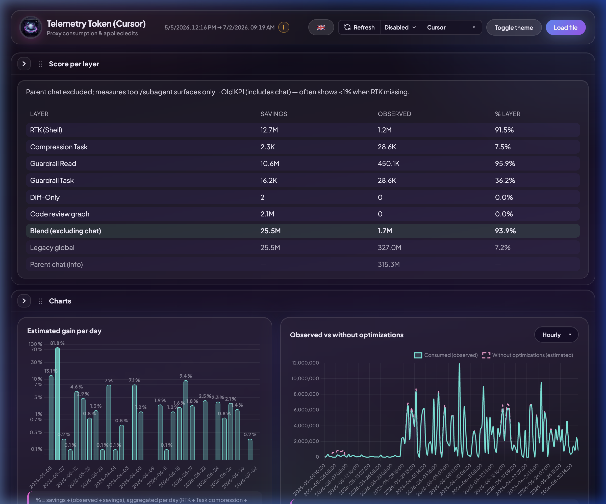

<p align="center">
  
</p>

# 🚀 S.C.R.O.O.G.E. - Context Optimization & Telemetry Stack

> **Métriques locales par proxy et compression intelligente des invites (prompts) pour les IDE de nouvelle génération**

[](https://python.org)
[](#)
[](#)
[](../../LICENSE)

S.C.R.O.O.G.E. (Smart Context Reducer & Optimized Observability Governance Engine) est une suite locale de métriques de proxy de développement et d'optimisation conçue pour mesurer, visualiser et réduire considérablement le coût d'exécution des workflows de programmation assistés par IA. Elle intercepte automatiquement les requêtes d'agent, applique des stratégies de compression agressives et surveille la conformité de l'espace de travail en temps réel.

---

## 📸 Aperçu du Dashboard

### 📊 Métriques principales et Gains
Le tableau de bord propose un thème "style terminal" néon sombre avec des cartes de KPI, des histogrammes de tokens en temps réel et un graphique factuel affichant l'utilisation observée par rapport à la consommation estimée sans optimisations.


### 🔍 Détails des sous-agents et Conformité
Faites défiler vers le bas pour suivre chaque session de sous-agent, analyser les contrôles de conformité aux règles (par exemple, les rapports de consommation, la vérification des briefs de tâche) et identifier les outils générant le plus d'économies.


---

## ✨ Fonctionnalités Clés

1. **📊 Télémétrie locale S.C.R.O.O.G.E.**
   - Enregistre les métriques de manière asynchrone dans un fichier local `events.jsonl`, puis les synchronise de façon incrémentale dans une base SQLite centrale (`telemetry.db`).
   - Les endpoints de requêtes interrogent directement la base SQLite indexée pour des recherches rapides en O(log N).
   - S'exécute aussi comme une **App macOS Desktop native** (via PyInstaller) pour une expérience autonome sans navigateur.
   
2. **🗜️ Compression de contexte & Optimisations**
   - **RTK Gain** : S'intègre avec les économies de commandes shell (jusqu'à 98% d'économie sur les exécutions de commandes).
   - **Protocole Diff-Only** : Applique des correctifs de type SEARCH/REPLACE pour éviter de réécrire des fichiers entiers, économisant jusqu'à 95% des tokens de sortie.
   - **Claw Compactor & LLMLingua** : Réduit la taille du contexte dynamique en élaguant les informations de faible importance avant l'envoi de la requête.

3. **🔄 Routage de contexte adaptatif**
   - Assemble les requêtes de manière déterministe :
     1. `BLOCK_1` : Règles système globales, règles Cursor locales et skills actives.
     2. `BLOCK_1B` : Garde-fous du budget de tokens.
     3. `BLOCK_2` : État Git et Workspace.
     4. `BLOCK_3` : Historique des messages compressé.
     5. `BLOCK_4` : Dernière requête utilisateur.
   - Compresse automatiquement l'historique au-delà de 8 messages ou 3000 tokens.

4. **⚡ Cache Git Pré-flight**
   - Calcule une signature basée sur `git branch + HEAD SHA + modified files`.
   - Réutilise instantanément les états d'espace de travail déjà compactés, évitant un appel de résumé LLM redondant.

5. **🛡️ Conformité et Gouvernance**
   - Bloque les sous-agents si le brief de tâche est manquant ou invalide.
   - Valide que l'agent génère un rapport de consommation structuré à la fin de chaque tour.
   - Tous les hooks utilisent une enveloppe d'exécution fail-safe pour s'assurer qu'aucun crash de script ne bloque l'éditeur de code.

---

## 📂 Structure du Dépôt

| Fichier / Répertoire | Description |
|---|---|
| 🛠️ [install_stack.py](file:///Users/blegouge/www/private/SCROOGE/install_stack.py) | Script d'installation interactif, idempotent et automatisé. |
| 🌐 [serve_dashboard.py](file:///Users/blegouge/www/private/SCROOGE/serve_dashboard.py) | Backend HTTP léger servant l'API du dashboard et l'interface HTML. |
| 🖥️ [dashboard_app.py](file:///Users/blegouge/www/private/SCROOGE/dashboard_app.py) | Chargeur de fenêtre de bureau native utilisant `pywebview`. |
| 🎨 [dashboard.html](file:///Users/blegouge/www/private/SCROOGE/dashboard.html) | SPA moderne à thème sombre avec mise en page dynamique et rafraîchissement automatique. |
| 🎨 [dashboard.css](file:///Users/blegouge/www/private/SCROOGE/dashboard.css) | Feuilles de style CSS indépendantes extraites pour la SPA. |
| ⚡ [dashboard.js](file:///Users/blegouge/www/private/SCROOGE/dashboard.js) | Logique applicative du client dashboard, graphiques Chart.js dynamiques. |
| 🗄️ [telemetry_db.py](file:///Users/blegouge/www/private/SCROOGE/telemetry_db.py) | Gestionnaire de la base SQLite et des synchronisations incrémentales. |
| ⚙️ [telemetry_config.py](file:///Users/blegouge/www/private/SCROOGE/telemetry_config.py) | ConfigManager centralisant les options d'environnement et de compression. |
| 📊 [report.py](file:///Users/blegouge/www/private/SCROOGE/report.py) | Outil CLI pour afficher le résumé de consommation directement dans le terminal. |
| 📁 [docs/verify_stack.py](file:///Users/blegouge/www/private/SCROOGE/docs/verify_stack.py) | Suite de tests automatisée post-installation validant tous les composants. |
| ⚙️ [providers_config.py](file:///Users/blegouge/www/private/SCROOGE/providers_config.py) | Logique de mapping des répertoires et des providers IA. |
| ⚙️ [providers_config.yaml](file:///Users/blegouge/www/private/SCROOGE/providers_config.yaml) | Définition YAML des répertoires IDE et de la configuration des prix. |

---

## 🚀 Guide d'Installation

Exécutez l'installateur automatisé depuis la racine du dépôt :

```bash
python3 install_stack.py
```

### Ce que fait l'installateur :
1. **Sélection du dossier cible (Hub)** : Détecte et déploie les templates de configuration dans `~/.cursor`, `~/.gemini/antigravity` ou un emplacement personnalisé.
2. **Dossier de codebases** : Demande le chemin de votre dossier de projets pour configurer le MCP code-explorer.
3. **Moteur de compression** : Configure l'utilisation de `claw`, `headroom`, les deux (`both`), ou désactive la compaction.
4. **Configuration interactive des secrets** : Récupère vos clés d'API (Grafana, GitHub, MySQL, etc.) et les stocke dans un fichier `.env` sécurisé (`chmod 600`).
5. **Environnement virtuel Python** : Crée un environnement dédié `.venv-desktop` et y installe les dépendances.
6. **Normalisation des règles/skills** : Réécrit dynamiquement les références textuelles selon l'IDE cible (Cursor vs Antigravity).
7. **Validation** : Exécute [verify_stack.py](file:///Users/blegouge/www/private/SCROOGE/docs/verify_stack.py) pour valider l'état fonctionnel de chaque brique.
8. **Lancement de service** : Propose de lancer automatiquement le démon du dashboard en tâche de fond sur le port `8765`.

---

## ⚙️ Vue d'ensemble des configurations

### 1. `compression.env`
Définit les paramètres et seuils pour la compression de contexte :
```ini
# Configuration de la compression de contexte
COMPRESSION_BACKEND=claw
TASK_BRIEF_ENFORCE=deny
LLMLINGUA_HOOK_RATE=0.5
ADAPTIVE_CTX_TOKEN_THRESHOLD=4000
ADAPTIVE_CTX_MESSAGE_THRESHOLD=10
CCR_ENABLED=1
```

### 2. `mcp.secrets.env`
Stocke les clés d'API et identifiants privés chargés par les scripts wrappers MCP :
```ini
GITHUB_PERSONAL_ACCESS_TOKEN=ghp_...
GRAFANA_API_TOKEN=glsa_...
MYSQL_PASSWORD=...
```

### 3. `hooks.json` & `mcp.json`
Situés dans le dossier Hub (ex: `~/.cursor/`), ils définissent les hooks actifs (ex: `postToolUse`, `afterAgentResponse`) et enregistrent les serveurs MCP locaux.

---

## 🖥️ Utilisation

### Rapport en Terminal
Affichez le résumé de consommation de votre session active :
```bash
python3 report.py
```

### Lancement du Dashboard Web
Si vous ne l'avez pas lancé lors de l'installation, exécutez :
```bash
python3 serve_dashboard.py
# Ouvrir http://127.0.0.1:8765/
```

### Compilation en Application macOS autonome (`.app`)
Pour générer un exécutable double-cliquable dans votre Dock macOS :
```bash
./build_macos_app.sh
```
Cela générera `dist/SCROOGE.app` via PyInstaller, inclura l'icône de l'application et effectuera une signature locale.

---

## 🔒 Confidentialité & Rotation
Les charges utiles échangées avec l'assistant (pouvant contenir du code, des clés de projets ou des chemins de fichiers locaux) sont journalisées exclusivement en local dans le fichier `events.jsonl`.
Gardez ce fichier privé et effectuez des rotations ou purges régulières.
