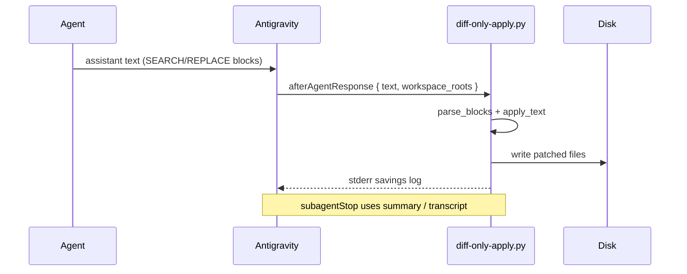

# Diff-Only — global integration (all workspaces)

## Pipeline



## Hook registration (`~/.gemini/antigravity/hooks.json`)

Already wired for **user-level** hooks (all workspaces using this Antigravity home):

| Event | Script | Source text |
|-------|--------|-------------|
| `afterAgentResponse` | `hooks/diff-only-after-response.sh` | `text` |
| `subagentStop` | `hooks/diff-only-subagent-stop.sh` | `summary`, else `agent_transcript_path` |

Telemetry row: `diffOnlyApply:*` in `~/.gemini/antigravity/token-telemetry/events.jsonl`.

## Manual / CI apply

```bash
python3 ~/.gemini/antigravity/src/utils/diff_applier.py --workspace /path/to/repo - <<'EOF'
path: src/foo.py
<<<<<<< SEARCH
old
=======
new
>>>>>>> REPLACE
EOF
```

## Subagent brief (copy-paste)

```text
Diff-Only mandatory: read ~/.gemini/antigravity/src/rules/diff_protocol.md
Return ONLY path + SEARCH/REPLACE blocks for code changes.
Do not dump full files. Do not also StrReplace the same hunks.
```

## Failure → agent correction

- **SEARCH not found** / **ambiguous** → hook stderr + `subagentStop` may auto-send `followup_message` (loop_count < 3).
- Fix: re-read file, resend **only** failed hunks with more context lines.

## Disable

```bash
export ANTIGRAVITY_DIFF_ONLY_DISABLE=1
```

Or remove the two hook entries from `~/.gemini/antigravity/hooks.json`.
